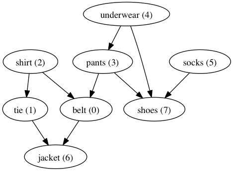
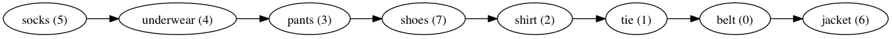

## do things with graphs

[](https://travis-ci.org/endoxajs/endoxa-graph)

On the **server** side

```sh
# command line
npm install endoxa-graph
```

```js
// javascript code
var EndoxaGraph = require('endoxa-graph');
// have fun
```

On the **client** side

```sh
# command line
bower install endoxa-graph
```

```js
// javascript code
require(['endoxa-graph'], function(EndoxaGraph) {
  // have fun
});
```

On the **developer** side

```sh
    # command line (use "sudo" if necessary)
    npm install
    
    # install grunt (use "sudo" if necessary)
    npm install -g grunt-cli
    
    # make sure everything installed correctly
    grunt test
```

### do things in the right order

When you get dressed you have to do some things before others.



OK, so what order should you do it? Ask endoxa:

```js
EndoxaGraph.toposort(
  EndoxaGraph.fromConnectionsList([
    [0, 6],
    [1, 6],
    [2, 0], [2, 1],
    [3, 0], [3, 7],
    [4, 3], [4, 7],
    [5, 7]
  ])
);
// -> [5, 4, 3, 7, 2, 1, 0, 6]
```


## Contributing

The first thing you will want to do is fork and clone this repo, and set
the project up so you can run the tests.

```sh
# command line (use "sudo" if necessary)
npm install

# install grunt (use "sudo" if necessary)
npm install -g grunt-cli
```

Now you should be able to run the tests. Just do this

```sh
grunt test
```

If you just cloned the project then you should see all the tests pass.
Now you're ready to contribute. Note that the code you write needs to
conform to the JSHint conventions. To check your code, run

```sh
grunt jshint
```

It will tell you how to fix any errors. We enforce this style so that
the code stays consistent and easy to read.

### Ways you can help

* **Adding more tests for existing algorithms.** Tests live in the `test/`
directory. Look at the code inside to get an idea how to write new
ones.
* **Write tests for algorithms that haven't been implemented yet.**
You'll want to copy one of the files like `test/dfs.js` and give it
a name to match your algorithm. For instance, breadth-first search
might go in `test/bfs.js`. Because your test will fail (the algorithm
has not been implemented yet) you should send a pull request to the
`unimplemented_tests` branch, not the `master` branch. We want to keep
`master` always passing.
* **Write algorithms to implement tests.** Create a branch off master,
cherry-pick a commit from `unimplemented_tests` which adds the test you
want to implement, and write your code. When everything passes, send
a pull request to master.
* **Refactor an existing algorithm to use more beautiful and functional
code.** This is the whole point of Endoxa, this is where the magic
happens. Make sure the tests still pass after your strokes of genius.

## About EndoxaJS

Endoxa means *established wisdom*. This collection of modules form an
elegant base for JavaScript functional programming on both the client
and server. The idea is that abstractions need to prove themselves in
substantial code, and this library works backwards from interesting
algorithms to the abstract nonsense that makes it beautiful.

<p align="center">
  
</p>
